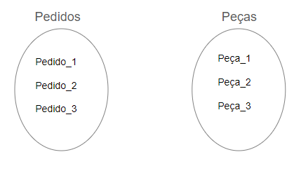
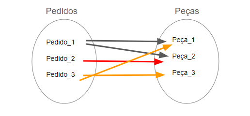
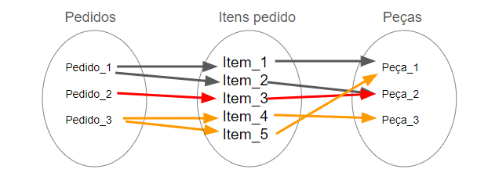
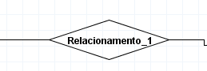
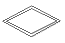

# **`Modelagem de dados` (feita antes da criação do BD)**

É um dos processos mais importantes ao se trabalhar em um projeto de banco de dados. Nele, os dados são levantados, tratados e estruturados para, assim, termos uma boa base para a construção de um banco de dados.

- visualizar e fazer a concepção dos dados

#
São usados na criação da modelagem:

- Texto
- Diagrama
- Simbolo
#
## **`Modelo Conceitual`(ou Domínio)**

- Foca no entendimento dos requisitos do sistema, pois explora as estruturas e conceitos do negócio
- Representação visual
- Pode parecer abstrato
- Fundamental para todos que vão trabalhar com dados(Ex.: ADM de BD(DBAs), Cientistas de Dados, Analista de sistemas, Desenvolvedores)
#
## **`Modelo Lógico`**

Criado para realizar a descrição de como os dados serão armazenados no sistema. Ele explora os conceitos de domínio.

Nesse modelo, descrevemos:

- Entidades
- Atributos 
- Chaves primárias e estrangeiras
- Relacionamentos
#
## **`Modelo Físico`**

Criado para descrever:

- Tabelas
- Suas colunas
- Relacionamentos

Diferente do modelo lógico, podemos utilizar uma linguagem padrão para realizar essa representação: a `linguagem SQL`, utilizada para trabalhar com banco de dados relacionais.
#
## **`SGBD`(Sistema Gerencial de Banco de Dados)**

Interface para:

- Incluir dados
- Alterar dados
- Consultar dados

Tudo o que fazemos em um Banco passa pelo SGBD

Exemplo de SGBD: 

- MySQL
- Oracle
- PostgreSQL
- MariaDB
- MongoDB
- Microsoft SQL Server
- IBM DB2
- SQLite
#

## **`Alto nível`** 

Relacionado a linguagem do usuario

- Modelagem de dados
#
## **`Baixo nível`**

Relacionado a linguagem das maquinas

- SGBD
#
## **Software de Desenho do modelo**

Vantagens:

- Faz a conversão do modelo conceitual para o modelo lógico e para o modelo Físico, de uma forma simplificada e automatica

- Os simbolos utilizados já estão disponivel de uma forma mais prática
#
## **Ferramentas CASE para modelagem**

`CASE` (Computer-Aided Software Engineering, ou Engenharia de Software Assistida por Computador)
#
Ex.:

- `BrModelo` 
    - Software brasileiro e gratuito. 
    
    - Funciona muito bem para modelagem conceitual

    - Permite realizar alterações estruturais no modelo, conforme são tomadas novas decisões pela pessoa analista;

    - Traz uma atenção especial aos atributos e todas as suas especificações;

    - Possibilita uma visualização mais “limpa” do esquema ao ocultar os atributos que não tenham relevância no modelo conceitual, mas que são relevantes no modelo lógico, por exemplo;

    - Possui um dicionário de dados bem completo.

    ## **Instalação BrModelo**

    **Windows**

    https://sourceforge.net/projects/brmodelo/

    **Linux**

    - Instalar Java:

        ```
        sudo apt-get -y  install default-jdk && \
        sudo apt-get -y  install default-jre
        ```
    - Verificar se instalou corretamente:

        ```
        java --version && \
        javac --version
        ```
    - Download do brModelo:

        ```
        curl -OL http://www.sis4.com/brModelo/brModelo.jar
        ```
    - Cria pasta:

        ```
        mkdir $HOME/.brModelo
        ```
    - Move o arquivo para a pasta criada:

        ```
        mv brModelo.jar $HOME/.brModelo
        ```
    - Baixa a imagem para ser utilizada como atalho:

        ```
        curl -o ~/.brModelo/brModelo.png -OL https://github.com/chcandido/brModelo/raw/master/src/imagens/logico.png
        ```
    - Cria um atalho no menu do sistema:

        ```
        echo -e "[Desktop Entry]\n
        Version=1.0\n
        Name=brModelo\n
        Exec=java -jar /home/${USER}/.brModelo/brModelo.jar\n
        Icon=/home/${USER}/.brModelo/brModelo.png\n
        Type=Application\n
        Comment=The software for MER\n
        Path=/home/${USER}/.brModelo\n
        Terminal=false\n
        StartupNotify=true\n
        Categories=Development;Education;" | tee $HOME/.local/share/applications/brModelo.desktop
        ```
    - Cria um atalho na área de trabalho:

        ```
        cp $HOME/.local/share/applications/brModelo.desktop $HOME/Desktop
        ```
    #
    - Remover o programa:

        ```
        rm -R $HOME/.brModelo
        ```
    - Remove o programa do menu de aplicativo:

        ```
        rm $HOME/.local/share/applications/brModelo.desktop
        ```
    - Remove o atalho na área de trabalho:

        ```
        rm $HOME/Desktop/brModelo.desktop
        ```

- `OracleDesigner ™ (Oracle ®)`: possui uma arquitetura flexível e pode ser instalada em múltiplas plataformas;

- `PowerDesigner ™ (Sybase ®)`: um dos mais utilizados no mercado;

- `ERWin (CA ®)`: também é muito utilizado no mercado;

- `Freeware DBDesigner`: possui uma grande quantidade de recursos;

- `PyDesigner`: está disponível para a plataforma Linux;

- `VISIO ™ (Microsoft ®)`: ferramenta direcionada exclusivamente para desenho. (Disponivel gratuitamente no excel, na opção suplementos)
#
## **Passo a passo para instalação do `brModelo`**

- Instalar JAVA

- Instalar BrModelo
    - https://sourceforge.net/projects/brmodelo/
    - Descompactar
    - Abir pasta brModelo
    - Abrir pasta dist
    - Executar o arquivo brModelo
#
## **Mini-mundo**

Recorte do mundo real

- Cliente 
- Compra
- Livro
- Autoria
- Autora

Cliente -> Compra -> Livro -> Autoria -> Autora

    - A Compra tem `Relação` com o Cliente e o livro

    - A Autoria tem `Relação` com o Livro e a Autora
#
## **Abstração**

- Processo mental
- Permite escolher ou isolar um aspecto determinado de coisas complexas 
- Finalidade de simplificar a sua avaliação

Como se tivesse dando dando um zoom-out e vendo e escolhendo os pontos principais 

Para saber quais são os principais pontos para se construir um mini-mundo junto com a abstração é necessario se ter uma entrevista com o usuario(Ex.: diretoria...)
#
## **Material usado**

https://caelum-online-public.s3.amazonaws.com/2420-modelagem-banco-dados-entidades-relacionamentos-atributos/01/Entrevista%20clube%20do%20livro.docx
#
## **`MER` e `DER`**

- `MER` - Modelo Entidade Relacionamento

É usado para representar de forma abstrata como os BDs vão se comportar 

    - Modelo conceitual
    - Usado para descrever objetos do mundo real(Entidades), suas características e como se relacionam

- `DER` - Diagrama Entidade Relacionamento
    - Representação gráfica do `MER`
    - Muitas vezes é usado como sinônimo do MER
    - O diagrama facilita a comunicação entre todos
#
## **Entidades**

- É um objeto/pessoa único(a) no mundo real
- Clientes de uma empresa
- Carros que são vendidos
- Departamento de vendas 
- Pode ser abstrata(Não é possível tocar) ou concreta

A representação é feita atraves de um `Retangulo`
#
## **Entidade Forte x Fraca**

`Entidade Forte` - Existe independentemente de outra entidade
    - Possui chave primária(Atributo)
    - Possui um unico retangulo

`Entidade Fraca` - Depende da existência de outra entidade
    - Não possue chave primária(Atributo)
    - Possui um retangulo duplo da sua representação
    - Possui uma chave composta formada a partir da chave primária da entidade forte e chave parcial da entidade fraca.
#
## **Tipos de Relacionamentos**

Os relacionamentos são representedos pelo `losangulo` fica de baixo do botão da entidade

**Tipos de relacionamentos:**

- Binário(2)
- Ternário(3)
- n-ário(4 ou mais)

Para ligar o relacionamento com as entidades é só ir no botão na direita da tela chamado `criar ligação entre dois artefatos` ou apenas segurando o `CTRL e selecionar as entidades` que irá criar o relacionamento automaticamente
#
## **Cardinalidade**

Duas coisas que tem uma Conectividade, se faz conexão com um unico objeto ou se faz conexão com varios

**Tipos de cardinalidades:**

- (1:1) Um <-> Um
- (1:n) Um <-> Muitos
- (n:m) Muitos <-> Muitos

Posição a esquerda equivale a cardinalidade minima e na direita a cardinalidade maxima
#
## **Outra forma de encontrar a cardinalidade minima**

Conhecida como `restrição de participação` ou `dependência de existência.`

Utilizada para especificar se a existência da entidade depende da associação a uma outra entidade, ou seja, depende do relacionamento. Existem dois tipos de restrição de participação: `restrição total` e `restrição parcial`.

- `Restrição total` - Quando todas as instâncias de uma entidade X precisam estar obrigatoriamente relacionadas a alguma instância da entidade Y.

    Ex.: Todo(a) colaborador(a) precisa estar associado a um departamento para que a pessoa possa trabalhar na empresa, consideramos que a restrição de participação entre colaborador(a) e departamento é total, pois, ele/ela precisa estar trabalhando em, no mínimo, um departamento.

- `Restrição parcial` - Quando todas as instâncias de uma entidade X não precisam estar obrigatoriamente relacionadas a alguma instância da entidade Y.

    Ex.: Todo departamento precisa ser gerenciado por um(a) colaborador(a), mas nem todo(a) colaborador(a) precisa ser gerente de um departamento. Então, consideramos que a restrição de participação entre a relação de colaborador(a) gerenciar um departamento é uma restrição parcial, pois nem todo(a) colaborador(a) irá gerenciar um departamento.
#
## **Resolução de relacionamentos muitos-para-muitos**

Sempre quando se tem um relacionamento de muitos-para-muitos esse relacionamento pode se tornar uma entidade já que está se tornando um fato. Essa entidade é chamada de `Entidade Associativa` e a sua representação é feita atraves de um `retangulo com um losangulo dentro`

As entidades associativas nos ajudam a organizar e deixar de forma mais explicativa o que acontece dentro de um relacionamento muitos-para-muitos. Por exemplo, quando temos 2 entidades com relacionamento N:M, com pedidos e peças de uma montadora de carros:



Um pedido poderia conter várias peças e uma peça poderia estar contida em vários pedidos diferentes.



Quando temos um relacionamento deste tipo, no qual todas as instâncias se relacionam, o conceito de atributo chave não será aplicado, já que podemos ter várias instâncias com o mesmo valor. Ao criar uma entidade associativa entre esse relacionamento, geramos dois novos relacionamentos um-para-muitos (1:n), no qual a entidade associativa será a única que receberá várias instâncias na relação:



Na nova relação criada entre pedidos e itens pedido a cardinalidade será representada da seguinte forma: um pedido pode estar relacionado a vários itens, porém um item só pode estar relacionado a um pedido. Já a relação entre Peças e itens pedido, a cardinalidade será representada da seguinte forma: uma peça pode estar relacionada a vários itens, mas um item só pode estar relacionado a uma peça.

Assim, teremos a relação entre pedidos e itens pedido como N:1 e a relação itens pedido e peças como 1:N, na qual a entidade associativa faz a intermediação entre as entidades pedidos e peças.

Livro para aprofundar no assunto: https://www.google.com.br/books/edition/BANCO_DE_DADOS_PROJETO_E_IMPLEMENTA%C3%87%C3%83O/DZHODwAAQBAJ?hl=pt-BR&gbpv=0
#
## **Relacionamentos e grau dos relacionamentos no DER**

O grau de um relacionamento é determinado pelo número de entidades envolvidas na mesma relação. Geralmente, vamos identificar os relacionamentos através de verbos como: compra de, depende de, etc.

Os relacionamentos são representados pela figura de um losango. Caso seja um relacionamento que possua uma entidade fraca, a representação seguirá o padrão de dois retângulos duplos no diagrama (assim como acontece na representação das entidades), como mostramos abaixo:

**Relacionamento forte:**



**Relacionamento fraco:**


#
## **Atributos**

- São sempre ligados as entidades
- São caracteristicas 

Não se pode ter uma entidade sem um atributo, pq se tiver uma entidade que não tiver nenhum atributo, ela não precisaria ser uma entidade em si, e sim, um atributo de outra entidade. 

É represenado por uma `Bola com um traço`

**Tipos de atributos:**

- Valor único (atômico) => **`Atributo simples`**
- Mais de um valor (multivalorado) => **`Atributo multivalorado`**
    
    Passa a ter cardinalidade
- Armazenado => **`Atributo composto`**
    
    Um atributo dentro do outro
- Derivados => **`Atributo derivado e armazenado`**

    Derivado de outro atributos armazenados

    Ex.: Idade(Dia atual - Data de nascimento)
- Null

    Identificado como não aplicavel ou desconhecido

    Diferente de um atributo vazio ou com varios espaços
- Obrigatório(Not Null)
- Opcional

    Aceita o a opção Null
- **`Atributo chave`**

    Utilizado para identificar de forma única uma entidade, ou seja, os valores associados a esse atributo são distintos entre o conjunto de entidades. Como exemplo, podemos utilizar o Código do Produto. Ele é único e pode ser utilizado como atributo chave, uma vez que cada produto recebe apenas um Código distinto.
#
## **Chave estrangeira**

A entidade fraca recebe a chave primária da entidade forte com a qual está associada para compor a chave parcial.

A entidade fraca não possui chave primária. Por esse motivo, podemos ter atributos identificadores próprios da entidade fraca que irão compor essa chave parcial. Além disso, temos a chave primária da entidade forte, que se desloca até a entidade fraca.

Para essa chave que sai da entidade forte e chega na entidade fraca damos o nome de `chave estrangeira`. Poderíamos fazer uma analogia com a palavra estrangeira, já que ela originalmente pertence a outra entidade, e viaja até a entidade de destino.
#
## **Atributo de especialização**

Representado por um `triangulo contendo traços em cada ponta`
#
## **Chaves primarias**

São os atributos que são unicos e exclusivos da entidade 

Características:

- Nunca se repete
- Não pode ser nulo
- Só entidades fortes possuem chave primária
#
## **Chave parcial**

Atribuida a entidades fracas

Entidades fracas recebem a chave parcial + a chave primaria da entidade forte