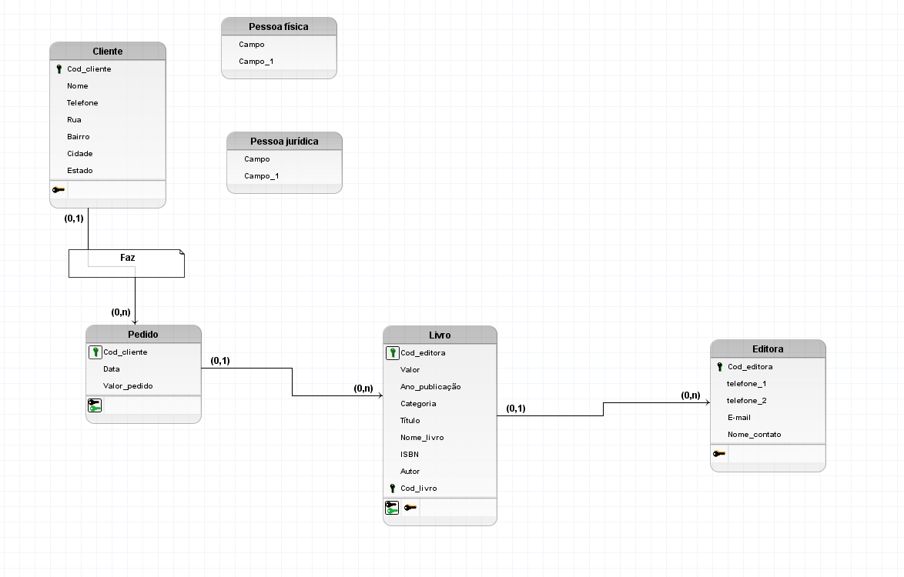
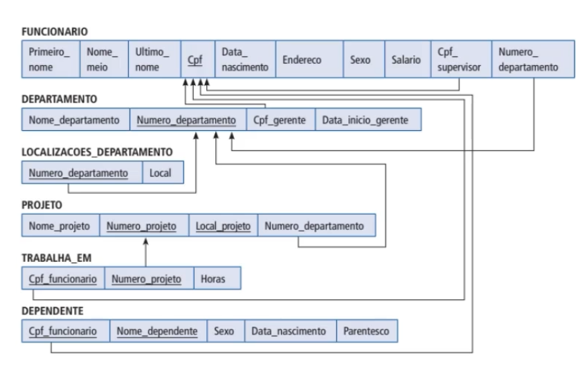
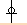
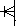
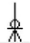
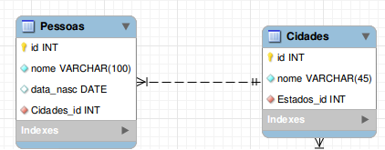

`Modelo conceitual` - de alto nível pois está perto da linguagem do usuario(humana)

- Regras do negocio, oq é interessante pro negocio - enxergar, armazenar como as informações vão se relacionar 
- Se define as entidades, atributos, relacionamentos e como se dá as cardinalidades

`Modelos Lógicos de Dados(MLDs) ` 

- É construido baseado no modelo conceitual e ajuda a implementar o BD em si. Acrescenta informações
- É raramente utilizado em projetos ágeis, pois o foco desse modelo está em descrever os conceitos de domínio e de envolvidos em um banco de dados.

`Modelos Físicos de Dados(MFDs)` 

- Está muito proximo do BD em si, pega o modelo lógico e acrescenta mais informações mais detalhadas 
- É largamente utilizado em projetos tanto ágeis quanto tradicionais e apresenta o projeto do banco de dados com uma maior riqueza de detalhes
- Tipo do campo(varcha, date, double, integer, null, not null, pk(key primary), fk(key estrageira), simbolos de relacionamento)
#
## **Representando o modelo lógico**

Criado a partir das descrições dos dados representadas em um modelo conceitual. Ele descreve como os dados serão armazenados no banco de dados, identificando as entidades, os atributos, as chaves primárias e estrangeiras e os seus relacionamentos.

**Formas de representar**

`Vertical` - os atributos (que mais a frente serão chamados de campos) são representados um abaixo do outro, os atributos chaves são identificados e os relacionamentos são representados através de linhas ligando uma relação à outra:

`Horizontal` - os atributos (campos) são apresentados um ao lado do outro, os atributos chave são sublinhados nas relações e os relacionamentos são representados através de uma seta, que sai da relação dependente e chega à relação proprietária. Já as cardinalidades não são representadas, como no exemplo a seguir:

#
**No modelo lógico:**

Entidade = Relações
#
**Software usado:**

`BrModelo`

No BrModelo ele trata a relação como tabela -> Entidade = Relação = Tabela

## **Como criar o modelo lógico no BrModelo**

Na parte de baixo das barra que contem(Arquivos, Editar, Diagrama...) tem os simbolos dos respectivos tipos de modelos, o segundo simbolo condiz com o modelo lógico
#

## **Boas práticas**

Diferenciação do nome da tabela(Entidade) para os campos(atributos):

Nome das tabelas são em maiusculo(CLIENTE) e o nome dos campos em minusculo
#
Ao desenvolver o modelo conceitual de um projeto, podemos identificar que alguns relacionamentos possuem atributos, que são normalmente conhecidos como **atributos de relacionamento**. Esses atributos estão diretamente ligados a um relacionamento, mas durante o processo de desenvolvimento do modelo conceitual é necessário mover esses atributos para uma das entidades participantes da relação e eles passam a ser conhecidos como **atributos migrados**.

Existem regras para que a migração do atributo do relacionamento para uma entidade seja feita. Em relacionamentos do tipo 1:1 ou 1:N podem ser migrados para uma das entidades participantes:

- Em `relações 1:1` o atributo **pode ser migrado para qualquer uma das entidades** pertencentes a relação, já que as duas entidades recebem apenas uma instância por vez do relacionamento.

- Em `relações 1:N` o atributo **será migrado para a entidade que recebe apenas uma instância por vez** do relacionamento.

- Em `relações N:M`, a regra é um pouco diferente, já que nenhuma das entidades participantes da relação recebem apenas uma instância por vez do relacionamento. Nestes casos, **os atributos não são migrados para uma entidade e permanecem no relacionamento, criando assim uma nova entidade, conhecida como entidade associativa.** Ela é composta pelos atributos vindos das duas entidades ligadas ao relacionamento e pelos seus atributos próprios.
#
## **Modelagem física**

**Software usado:** `SQL Power Architect`(Gratuito)

https://bestofbi.com/architect-download/

Depois que fizer a instalação, execute o SQL Power AArchitect e vai abrir uma parte para criar ou procurar um arquivo existente

**Outros Softwares para criação de Modelo Físico:**

` MySQL Workbench` - ferramenta muito utilizada na modelagem de banco de dados.

`Astah Professional` - permite gerar códigos a partir dos diagramas criados ou fazer uma engenharia reversa nos códigos existentes.

`DBDesigner 4 ` - muito utilizado nas faculdades durante o processo de aprendizagem de modelagem. Pode ser utilizada em conjunto com o MySQL.
#
## **Tabela(Entidade)**
No modelo físico damos os nomes da entidades como `tabela` tambem. 

**Adicionar tabela:**

- Ir na barra localizada na direita do software
- Selecionar a ferramenta `New table(Atalho => letra T)`

Assim que criamos a tabela vai aparecer uma sessão para preencher o `nome logico da tabela`(Podemos dar qualquer nome pq é uma referencia da modelagem), `nome físico da tabela`(Nome que será implementado no BD) e o `nome da chave primaria`

Em relação aos nomes logicos e físicos é ideal que ele fiquem bem parecidos para não se confundir

EX.: 

Nome logico: CLIENTE 

Nome físico: Tb_CLIENTE

Nome Chave Primaria: Tb_CLIENTE_pk

Remarks(Comentarios) - Quando trabalhamos em equipe é ideal ter o comentario para saber do que se trata aquela tabela
#
## **Colunas**

**(Atributos = Campos = Colunas)**

No modelo físico damos os nomes dos atributos de `colunas`.

Atribuir colunas nas tabelas: 

- Selecionar tabela
- Ir na barra localizada na direita do software
- Selecionar o segundo icone a baixo da opção de criar tabela `Insert column(Atalho = letra C)`
#
## **Domínio**

Designa o tipo de dados que será aceito na coluna

**Tipos de dados numéricos:**

- `Int` ou `Integer` - valores numéricos inteiros.
- `Float` - valores numéricos aproximados com precisão de ponto flutuante.
- `Decimal` - valores numéricos com casas decimais, utilizando precisão.

**Tipos de dados string:**

- `Varchar` - string de tamanho variável de acordo com o seu limite.
    
    **Vantagens:**

    - Campo de cpf - se o cpf começar com 0 o 0 ficará aparente no campo utilizando `varchar`, pois o numero será transformado em texto. Já no tipo `int` o 0 a esquerda é ignorado, e não aparece no campo.
    - Campo telefone - se for aceitar `()` e `-`
- `Char` - string de tamanho fixo.
- `Text` - string de tamanho variável.

**Tipos de dados Data:**

- `Date` - apenas valores de data.
- `Time` - apenas valores de hora.
- `Timestamp` - valores de data e hora.
#
**Preenchendo os dados da coluna**

- Nome Logico
- Nome físico
- Se tem Primary Key
- Tipo(Domínio)
- Precision(Limite de caracteres)
- Allows Nulls(Se é permitido null, lembrando que se a coluna tiver pk não é possível ter null, então, caso for marcado ira continuar como `no` pq se tem pk não poder conter a opção null ativa)
#

**Alterar dados da coluna já existente**

Para fazer a alteração é só dar um duplo clique no campo desejado e fazer as alterações.
#
## **Relacionamentos**

**Adicionando `relacionamento não identificador`:**

- Barra lateral direita do software
- Selecionar `New Non-Identifying Relationship`
- Selecionar a tabela que contem a chave primaria
- Clicar na tabela que deseja fazer o relacionamento

Quando fazemos o relacionamento não identificador, a chave estrangeira é gerada automaticamente na tabela destino, sendo Chamada de FK(chave estrageira) que no caso seria a chave primaria da tabela forte. 

**Adicionando `relacionamento identificador`:**

- Barra lateral direita do software
- Selecionar `New Identifying Relationship`
- Selecionar a tabela que contem a chave primaria
- Clicar na tabela que deseja fazer o relacionamento

Adiciona a chave estrageira e diz que a chave estrageira vai servir como primaria pra essa tabela, sendo chamada de PFK(Chave parcial => Chave primaria = Chave estrageira)
#
No modelo físico não precisamos tem duas chaves parciais, podemos conectar uma tabela fraca com outra tabela fraca no modelo físico. Assim permanecendo apenas a chave parcial do da tabela fraca e não sendo necessario ter a chave parcial da tabela forte junto.
#
O `relacionamento identificador` é aquele na qual uma ocorrência da entidade fraca, precisa estar associada a exatamente uma ocorrência da entidade forte e não pode existir sem ela. Nesse caso, esse relacionamento é utilizado para representar uma chave primária estrangeira. Já no `relacionamento não identificador`, cada ocorrência da entidade fraca pode ser identificada sem a necessidade de saber a qual ocorrência da entidade forte está associada. É utilizado para representar apenas chaves estrangeiras.
#
## **Sinais(Cardinalidade)**

- (1,1) Exactly One 

    
- (0,1) Zero or One

    
- (1,n) One or More

    
- (0,n) Zero or More

    

Para alterar o tipo do sinal(cardinalidade) é só dar um duplo clique na barra do relacionamento e ir em `Carnality`
#
## **Modelo Físico Feito no `MySQL Workbench`**

Exemplo do `MySQL Workbench`, em que os atributos são representados na vertical. As relações entre as tabelas são representadas com símbolos semelhantes a pés de galinha, ou tridentes, como no `SQL Power Architect`, já o campo definido como `chave primária` recebe o símbolo de uma `chave na cor amarela` e a `chave estrangeira` recebe o símbolo de um `losango na cor laranja`.

