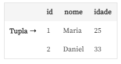
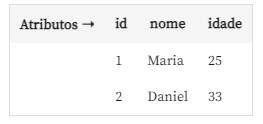
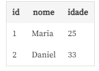

A álgebra relacional é baseada dentro da `Teoria dos conjuntos`

**Operações da Teoria dos conjuntos:**

- Interseção
- União
- Diferença
- Produto Cartesiano

**Software usado:**

`Relational`

https://ltworf.github.io/relational/download.html

Usado para importar a base de dados e fazer as consultas

Dentro do software:

- Barra da esquerda - Operações
- Ultimo Campo na metade da tela - Fazer as consultas
- Parte do meio da metade da tela - Historicos das consultas
- Parte superior da metade da tela - Resultado das consultas
- Lateral direita - Atributos, Relações e onde importamos a base de dados

**Operações especificas do software:**

- Renomear
- Atribuir em uma variavel 
#
**DBA - Administração de Banco de Dados**
#
## **O que é `algebra relacional` e qual sua importância no dia a dia de trabalho?**

É uma forma teórica de manipular os dados em bancos de dados relacionais. 

- Oferece um suporte para operações dentro de bancos de dados relacionais

- Serve de base para o SQL. 

Em outras palavras, o SQL é derivado da álgebra relacional.
#
## **Operações específicas para bancos de dados relacionais**

- Seleção
- Projeção
- Junção(Baseado no SQL)
#
## **Importar base de dados para o relational**

- Botão Load na parte inferior na lateral direita do software
- Ao abrir a janela de busca de arquivos selecione os arquivos 

Os arquivos importados vão para a aba `Relations` na lateral direita
#
## **Operação de `Seleção`**

Retorna tuplas que satisfazem uma condição. Ou seja, precisamos de um filtro para que a seleção nos retorne o resultado desejado. Ela traz as tuplas que satisfazem as condições e descarta as demais.

**Tuplas**



Significa "linha", ou seja, a `tupla` é um registro na tabela.

**Atributos**



Os cabeçalhos das colunas são chamados de `Atributos`.

**Relação ou Entidade**

Todo conjunto que forma a tabela é chamado de `Relação` ou `Entidade`.


#
**Fórmula da operação de seleção**

```sql
σ <condicao_selecao>(R)
```

- `σ` - O símbolo sigma usado para representar a operação de seleção;

- `<condicao_selecao>` - Onde colocaremos a condição para que as tuplas sejam retornadas;

- `(R)` - Onde informaremos a tabela em que buscaremos a condição de seleção;

Dentro da condição de seleção, temos ainda algumas cláusulas:

- `<nome_atributo>` - nome da coluna;

- `<operador_comparacao>` - referente aos operadores, igual (=), maior que (>), menor que (<), maior ou igual (≥), menor ou igual (≤) e diferente (!=);

- `<valor_constante>` - valor que adicionaremos para buscar as tuplas.
#
## **Colocando em prática no relational**

Na lateral esquerda da tela, em "Operators", na penúltima linha, encontramos a operação de seleção "sigma (σ)". Vamos selecioná-la e digitar, no campo que está na parte inferior da tela, o nome do atributo `nome_livro` seguido do operador de comparação `==`. Portanto: `σ nome_livro ==`.

O Relational não reconhece o símbolo de igual sozinho, `=`, como igual. Nós precisamos escrever dois símbolos juntos, `==`, para que ele possa reconhecer e fazer a comparação. Como estamos fazendo a busca pelo nome do livro, uma string, então temos que usar aspas simples. Portanto, digitaremos duas aspas simples, `''` e, dentro delas, escreveremos o nome do livro: `'Percy Jackson e o Ladrão de Raios'`.

```sql
σ nome_livro == 'Percy Jackson e o Ladrão de Raios'
```

O relational é `Case Sensitive`, ou seja, precisamos escrever igual está na tabela. Se escrevermos algo com letra minúscula e na tabela estiver com maiúscula, ele não reconhecerá e nem fará a busca.

Após digitarmos o nome do livro, precisamos colocar, entre parênteses, o nome da tabela: `(livros)`.

```sql
σ nome_livro == 'Percy Jackson e o Ladrão de Raios'(livros)
```

Agora podemos apertar "Enter" ou o botão "Execute". 

Em seguida, será retornado não só o nome do livro, mas, sim, todos os atributos que fazem parte dele. 

Com a operação de seleção, também podemos usar os operadores lógicos `and`, `or` e `not`, que significam "e", "ou" e "não".

**Ex.:**

```sql
σ nome_livro == 'Percy Jackson e o Ladrão de Raios' or nome_livro == 'Sangue de Lobo'(livros)
```
#
## **Operação de `Projeção`**

Diferentemente da seleção, que seleciona algumas linhas e remove outras, a projeção **seleciona algumas colunas e remove outras**. A seleção não traz tuplas repetidas, ou seja, se tivermos um livro cadastrado mais de uma vez, ele não trará os dois registros, apenas um. A projeção faz a mesma coisa: se tivermos duas tuplas com o mesmo livro cadastrado, ele trará apenas um e descartará a tupla repetida.

Se estivermos interessados em trazer determinados atributos de uma relação, podemos usar a operação de projeção, que projeta os atributos da relação.

```sql
π <lista_atributos> (R)
```

- `π` - O símbolo pi representa a projeção.

- `<lista_atributos>` - são as colunas que desejamos trazer.

- `(R)` - tabela que estamos buscando na lista de atributos.

## **Colocando em prática no relational**

Todos os atributos precisam ser separados por vírgula. Então, escreveremos `π nome_livro, preco, qtd_estoque`. Em seguida, colocaremos o nome da nossa tabela entre parênteses, `(livros)`.

```sql
π nome_livro, preco, qtd_estoque (livros)
```

Apertando "Enter" todos os livros que existem na tabela "livros" serão retornados com o nome, preço e quantidade de estoque.

A `operação de projeção` é muito interessante para **trazer apenas colunas selecionadas**, mas também podemos utilizá-la com outras operações da álgebra relacional, em consultas mais robustas.
#
## **Álgebra Relacional e SQL**

A `álgebra relacional` é uma derivação da álgebra de conjuntos em relação às operações. Ela ajuda a identificar os componentes de uma tupla por nome (chamado o atributo) ao invés de uma coluna de chaves numéricas, na qual é chamada a relação na terminologia de banco de dados.

Ela recebia pouca atenção até a publicação do modelo relacional de dados de E.F Codd, em 1970. Em junho desse mesmo ano, Codd publicou um artigo chamado `Relational Model of Data for Large Shared Data Banks` ("Modelo de dados relacional para grandes bancos de dados compartilhados") que foi publicado na Revista `ACM` ("Association for Computing Machinery") Vol. 13.

Este artigo demonstrou os fundamentos da teoria dos bancos de dados relacionais usando tabelas ("linhas" e "colunas") e operações matemáticas para recuperá-los destas tabelas (UNION, SELECT, SUM). Ou seja, Codd propôs a álgebra relacional como uma base para a linguagem SQL. Dessa forma, podemos dizer que `o SQL é uma linguagem de consulta de banco de dados derivado da Álgebra Relacional`.
#
## **Desafio: consulta com Seleção e Projeção**

Foi proposto que informasse o nome e a quantidade dos livros com itens em estoque maior ou igual a cinco.

1- Projeta os campos que foram pedidos

- nome do livro e quantidade estoque

2- Faz uma seleção dentro da projeção com a condição necessária para encontrar a quantidade de estoque maior ou igual a cinco.

**Consulta:**
```sql
π nome_livro, qtd_estoque (σ qtd_estoque >= 5 (livros))
```
#
Caso o seu Relational esteja reconhecendo as colunas numéricas como string, você pode usar essa consulta:

**Consulta:**
```sql
π nome_livro, qtd_estoque (σ qtd_estoque >= '5' (livros))
```
#
## **Operação de `União`**

Junção de duas relações, independentemente do que esteja na relação 1 e na relação 2.

- `U` - representa a União.

**Relação R**


**Relação S**


#
A representação da `União` é atraves do `U`
#
**R U S**


**Ex.:**

Trazer o nome "Livro" da relação "livros" e também o nome "Livro" da relação "livros_novos". Ele já sabe como fazer isso usando a projeção.

Então, na lateral esquerda da tela, em "Operators", nós apertaremos "pi ( π)", que é o botão da projeção e digitaremos `nome_livro`. Entre parênteses, escreveremos o nome da tabela, `(livros)`. Apertaremos a projeção outra vez e escreveremos `nome_livro` seguida da tabela "livros_novos" entre parênteses, `(livros_novos)`.

Para fazer a união, usamos o símbolo de união entre as duas projeções. Então, navegaremos até o início da segunda projeção da tabela `livros_novo` e apertaremos o botão do símbolo de união, `U`, que também está em "Operators". Por fim, apertaremos "Enter".

```sql
π nome_livro (livros) U π nome_livro (livros_novo)
```
#
## **`Interseção`**

Faz uma união, com a diferença que ela trará todas as tuplas que existem na relação R e na relação S. 

- `∩` - representa a Interseção.

**Relação R**


**Relação S**


**R ∩ S**


#
## **Colocando em prática no relational**
## **Atribuição de consulta a uma `variável temporária.`**

**Consulta União:**
```sql
livros_estoque = π nome_livro (livros) U π nome_livro (livros_novo)
```

**Consulta Interseção:**
```sql
livros_estoque ∩ π nome_livro (vendas)
```
#
## **`Diferença` entre conjuntos**

Permite encontrar tuplas que estão em uma relação, mas não em outra.

- `-` - representa a Diferença.

**Relação R**


**Relação S**


**R - S**


#
Também vale se a operação for invertida. Isto é, se calcularmos S menos R, o resultado serão os nomes que estão na tabela S e não estão na R.
#
**S - R**


#
## **Colocando em prática no relational**

**Consulta União:**
```sql
livros_estoque = π nome_livro (livros) U π nome_livro (livros_novo)
```

**Consulta Interseção:**
```sql
livros_estoque - π nome_livro (vendas)
```

Retorna todos os livros que estão em estoque e que nunca foram vendidos. Inclusive, os livros da remessa nova.
#
## **Desafio**

Trazer o nome e o preço dos livros que tenham o valor maior ou igual a 30,00 reais na base de dados.


**`Minha Resolução`**

**União:**
```sql
livros_precos = π nome_livro, preco (livros) ∪ π nome_livro, preco (livros_novo)
```
**Seleção**
```sql
σ preco >= 30 (livros_precos)
```
#
**`Resolção alura`**

**Seleção**
```sql
maior_30 = σ preco >= 30 (livros)
```
**insere a Projeção**
```sql
maior_30 = σ preco >= 30 (π nome_livro, preco (livros))
```
**Faz a União com os livros novos**
```sql
maior_30 = σ preco >= 30 (π nome_livro, preco (livros) ∪ π nome_livro, preco(livros_novos))
```
#
## **`Produto Cartesiano`**

- `*` - O símbolo da multiplicação representa o Produto Cartesiano.

Pega uma tupla e multiplica por outra.

**R x S**


Pega a tupla "Maria" e faz a multiplicação com a tupla "Mylena". Também faz a multiplicação com a tupla "Paulo". Ou seja, vai fazendo combinações, pegando uma tupla e multiplicando por outra. Desta maneira, o produto cartesiano vai sendo retornado com todas as combinações entre as relações.
#
## **Colocando em prática no relational**

```sql
vendedores * vendas
```
Juntando essas duas relações, teremos um produto cartesiano das duas tabelas: de vendedores e de vendas.
#
Depois da realização de um produto cartesiano em uma relação, geralmente existe a necessidade de fazer uma seleção onde os campos que estão em R e também em S, no caso, as relações, sejam iguais, porque o produto cartesiano traz tuplas que não são de interesse.
#
## **`Junção`**

- `⋈` - O símbolo da gravata borboleta representa a Junção.

Realiza um produto cartesiano, depois uma seleção das tuplas de interesse e, por fim, uma projeção, para remoção das colunas duplicadas.
#
## **Colocando em prática no relational**
```sql
vendedores ⋈ vendas
```
O mesmo resultado do produto cartesiano foi retornado. Isso acontece porque entre as tabelas de vendedores e de vendas não existe um campo comum. Sendo assim, a junção não reconhecerá quais tuplas deveriam vir.

`ρ` - o símbolo rô representa a função `renomear`

Precisamos dar um nome a consulta: `vendas_novo =`, selecionamos o rô, `ρ` e digitaremos a tabela que desejamos renomear, `id_vendedor_vendas`. O próximo passo é identificar o nome que essa coluna terá.

Ao lado do rô, temos uma seta, `➡`, que faz parte da operação "renomear".

Selecionamos `➡` e escrevemos o nome que a nova coluna vai ter, `id_vendedor`. Entre parênteses, precisamos identificar a tabela de origem, `(vendas)`. Por fim, basta apertar "Enter".

```sql
vendas_novo =  ρ id_vendedor_vendas ➡ id_vendedor (vendas)
```

Agora o `id_vendedor` foi renomeado e podemos fazer a junção entre as duas tabelas. 

Desde que as entidades vendedores e vendas tenham atributo `id_pedido` em comum, a junção natural considera apenas as tuplas que tenham o mesmo valor em `id_pedido`. Ela combina cada um dos pares de tuplas em uma única tupla por meio da junção das entidades.
#
## **`Junção esquerda` e `direita`**

`Junção esquerda`

Pega todas as tuplas da entidade à esquerda que não encontraram par entre as tuplas da entidade à direita e adiciona, desta maneira, valores nulos nas tuplas da entidade da tabela à direita. Também adiciona o resultado. Ou seja, a junção esquerda traz todas as tuplas da entidade à esquerda no resultado.

O símbolo da gravata borboleta com o lado esquerdo preenchido representa a `Junção esquerda`:


#
`Junção direita`

Prioriza as tuplas da tabela à direita, isto é, trará todas as tuplas da tabela à direita e complementará com nulo as tuplas da tabela à esquerda se não tiverem dados.

O símbolo da gravata borboleta com o lado direito preenchido representa a `Junção direita`:


#
`Junção total`

Preenche as tuplas da entidade da esquerda que não encontram par na entidade da direita, assim como também preenche as tuplas da entidade da direita que não encontraram par na entidade da esquerda, adicionando-as ao resultado da junção.

O símbolo da gravata borboleta com os dois lados preenchidos representa a `Junção total`:


#
## **`Atribuição`**

Utilizada para designar a consulta a uma variável temporária. Ela é representada por uma seta para a esquerda ou com o `=` no caso do relational. Ao atribuirmos a consulta a uma variável temporária, fica fácil utilizar essa consulta posteriormente, já que ela fica salva no Relational.

**Ex.:**
```sql
R = π nome_livro (livros) ∪ π nome_livro (livros_novo)
```
#
## **Operação `Renomear`**

Permite alterar nomes de atributos de uma relação.

`ρ` - o símbolo rô representa a função `renomear`

## **Colocando em prática no relational**

- Selecionamos o rô, `ρ`
- Digitamos o nome do campo a ser renomeado
- Selecionamos `➡`(usado junto com o `ρ`) e escrevemos o nome que a nova coluna vai ter
- E entre parenteses indicamos a tabela/relação que será feita a alteração
- Para ficar salva na tabela atribuimos a operação renomear junto a atribuição(com o msm nome da tabela que desejamos renomear o campo)

```sql
livros_estoque = ρ autor ➡ autor_livro (livros_estoque)
```

**Renomeando mutiplos campos**

```sql
livros_estoque = ρ nome_livro ➡ nome_do_livro, qtd_estoque ➡ quantidade_estoque (livros_estoque)
```
#
## **Desafio**

Recuperar o `nome do vendedor`, a `quantidade vendida`, `nome` e `preço` dos `livros` que `tiveram vendas menores que oito` e depois `renomear` os `campos do resultado final`.

### **Tabelas para ser usadas:**

- **Tabela livros**

    

- **Tabela livros_novo**

    

- **Tabela vendas_novo**

    

- **Tabela vendedores**

    
#
### **Resolução**

**1- Uni as duas tabelas de livros**
```sql
livros_estoque = livros ∪ livros_novo
```


**2- Encontra os livros vendidos fazendo a junção**
```sql
livros_venda = livros_estoque ⋈ vendas_novo
```


**3- Encontra as venda de cada vendedor fazendo a junção**
```sql
vendas_vendedores = vendas_novo ⋈ vendedores
```


**4- Resultado final com os requisitos da questão**
```sql
resultado = σ qtd_vendida < 8 (π nome, qtd_vendida, nome_livro, preco (livros_venda ⋈ vendas_vendedores))
```
