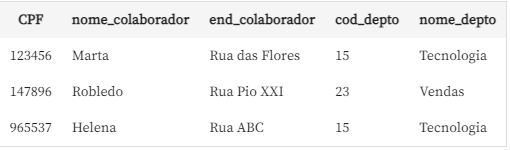

# **Normalização**

Processo utilizado para realizar a organização em um banco de dados.
#
## **Conceitos de Normalização**

- Diretrizes informais
- Anomalias
- Depedências Funcionais
- Regras Normais
#
## **Problemas de manutenção como:**

- Mistura de dados
- Redundância de Dados
#
Anomalias de Inserção, Remoção e Alteração tornam as tabelas de um banco de dados pesadas.

**Ex.:**

Uma tabela com vários dados, por exemplo, de pedidos. Dentro dessa tabela de pedidos, existem os dados dos clientes e dos produtos. Caso seja necessário alterar o dado de algum produto e essas tabelas de clientes e pedidos não estiverem separadas, teremos muitos problemas.

Se precisamos adicionar um novo produto e não temos os dados do cliente, afinal, estamos adicionando um produto que chegou agora no nosso estoque, por não termos um cliente para esse produto, os dados ficarão nulos. Isso não pode acontecer dentro do banco de dados. O processo de normalização facilita muito a manutenção e também o acesso ao banco de dados.
#
A normalização e também as **formas normais**, conjuntos de regras que nos permitirão normalizar o banco de dados.
#
## **Diretrizes informais**

conjunto de regras que nos ajudam a identificar a qualidade de um projeto de banco de dados.

1- Semântica clara com esquemas fáceis de explicar.

    **Ex.:**

    Uma tabela de clientes e fornecedores, seria complicado entender a qual assunto ela se refere. Não é recomendável que uma tabela tenha dados diferentes, dois ou mais assuntos. Isso gera ambiguidades e dificuldades para que o sistema gerenciador do banco de dados compreenda o que está acontecendo, ocasionando a redundância de dados e ocupando bastante espaço em disco.
2- Evitar informações redundantes.

    **Ex.:**

    Pode causar anomalias de inserção, remoção e alteração, gerando um retrabalho no banco de dados. Nós precisaríamos reinserir valores e dados e teríamos problemas para alterá-los.
3- Impossibilitar valores NULL nas tuplas.

    **Ex.:**

    Ter valores brancos/nulos dentro de uma tabela do banco de dados pode acarretar vários problemas, como desperdício de espaço em disco, dificuldade de entendimento dos atributos e problemas nas operações de junção e agregação dentro do gerenciamento do sistema.
4- Atenção ao surgimento de tuplas falsas.

    **Ex.:**

    Ao fazer uma junção de tabelas dentro de um banco de dados, precisamos usar a chave estrangeira. Além disso, sempre que criarmos uma tabela em relação com outra, precisamos estar certos que a junção entre elas será feita com chave primária e chave estrangeira. A junção não pode ser feita com outros atributos da tabela ou poderíamos ter tuplas falsas.
#
## **Anomalias**

São mudanças em dados que podem gerar **Inconsistências** dentro de um banco de dados relacionais.

A inconsistência se refere a valores que deveriam ser iguais, mas que estão diferentes. 

**Ex.:**

Temos a tabela de notas fiscais e recibos. O valor da compra deve ser o mesmo dentro da tabela de notas fiscais e recibos. Caso estejam diferentes, temos uma inconsistência.
#
## **Tipos de Anomalias:**

- Inserção

    Levam a repetição dos dados dentro do banco de dados relacional, que é a redundância.

- Alteração

    Levam inconsistências e exigem um esforço maior para atualização dos dados.

- Remoção 

    Causam a remoção de um dado necessário dentro da tabela, isto é, a remoção de um dado que não deveria ser removido.

**Exemplos de Anomalias**



**Anomalias presentes nessa tabela:**

- `Inserção` 
    - Ao inserir um novo colaborador é necessario adicionar o departamento. Com isso pode ocorrer que o colaborador ainda não esteja vinculado a um departamento ou vice-versa. 

    - Com a chave primaria sendo o CPF, deixar a parte de colaboradores em branco pode nos trazer algum problema, já que o CPF se refere ao colaborador e não ao departamento.

    - Repetição/Redundancia de dados, como é o caso da coluna `nome_depto`, onde o departamento de `Tecnologia` aparece duas vezes.
#
O correto é separar as tabelas, ou seja, definir uma tabela para colaborador e outra para departamento. Além disso, ter uma chave estrangeira do `cod_depto` na tabela de colaboradores para definir em qual departamento ele trabalha.
#
- `Alteração`
    - Sendo necessário alterar um departamento, precisaríamos alterar todos os registros em questão, gerando um `re-trabalho` dentro da tabela. O resultado é uma inconsistência dentro do banco de dados.

- `Remoção`
    - se for preciso remover um departamento ou até mesmo um colaborador, teremos que remover uma tupla inteira. Neste caso, aconteceria outra inconsistência que é a falta de dados.

#
Para evitarmos todas essas anomalias, podemos usar as formas normais e, consequentemente, normalizarmos o banco de dados.
#
## **O conceito de normalização não se aplica a todos os tipos de bancos de dados.**

**Ex.:**

`Os bancos de dados NoSQL` 

- Normalmente armazenam dados não estruturados
- Possuem uma estrutura de armazenamento bem diferente dos bancos de dados relacionais.
- Seu foco é garantir uma maior velocidade de consulta, disponibilizando uma maior escalabilidade.

Sendo assim as anomalias e redundância dos dados são toleradas em bancos de dados NoSQL.
#
## **Formas Normais**

São regras para realizar a normalização.

Para uma tabela estar em uma determinada `forma normal`, ela precisa satisfazer algumas propriedades baseadas nas `dependências funcionais`.
#
## **Dependências Funcionais**

- São restrições aplicadas sobre os atributos da tabela. Ou seja, quando um atributo depende de outro para que a sua existência faça sentido.

- Estabelece uma relação de atributos na tabela, por exemplo, a chave primária, que é ID, e define outra coluna na tabela.

- O atributo que determina o valor é chamado de `determinante`. 

- O outro atributo é chamado de `dependente`.

- Representada pelo `hífen (-)` e o sinal de `menor (>)`.

```sql
CPF -> nome
```
Isso quer dizer que o CPF determina funcionalmente o nome.
#
**Ex.:**


Na tabela, encontramos: 

- CPF do colaborador; 
- nome (Marta, Robledo, Helena e Marta); 
- endereço do colaborador. 

Atenção ao nome `Marta` que se repete na tabela.

Se buscarmos pelo nome Marta, aparecerão dois CPFs: `123456` e `437627`. Assim, fica difícil entender e encontrar a Marta que estamos procurando. Então, o **CPF é a Chave primária**, o `nome_colaborador` e `end_colaborador` dependem dessa chave primária para existirem dentro da tabela.

Portanto, que o CPF determina funcionalmente o nome do colaborador e também determina funcionalmente o endereço do colaborador. 

#
Cada forma normal deve satisfazer as propriedades de uma determinada dependência. Assim sendo:
#
## **`Primeira forma normal - 1FN`** 
    Deve satisfazer as propriedades baseadas na `dependência funcional`.

**Quais cuidados devem ser tomados para que uma tabela esteja na primeira forma normal?**

- Evitar a mistura de assuntos dentro de uma tabela
    - pode causar **repetições ou campos que tenham mais de um valor**, gerando redundância dos dados.

**Procedimentos para aplicar a regra:**

- **Identificar a chave primária** da tabela; e
- **Identificar o grupo repetitivo** e **removê-lo** da tabela

Assim, criando uma tabela nova com esse grupo repetitivo e usando a chave primária da tabela que está sendo quebrada como chave estrangeira dentro da tabela nova com o grupo repetitivo.
#
## **Dependência funcional parcial e total**

Só ocorrem quando temos uma chave primária composta.

`Dependência funcional parcial` - acontecerá quando os atributos não-chave dependem apenas de uma parte da chave primária composta.

`Dependência funcional total` - acontece quando os atributos não-chave dependem da chave primária composta em sua totalidade.
#


- Dentro da tabela de itens pedidos, `produto`, `qtd_estoque` e `preco` dependem funcionalmente e parcialmente apenas do `código produto`, porque são atributos referentes ao produto. Não faz sentido dependerem da nota fiscal.

- A chave primária na sua totalidade, isto é, a `qtd_vendida`, depende da `nota fiscal` e do `código do produto`, pois para encontrarmos a quantidade vendida nos itens pedidos, precisamos da nota fiscal.

- Além disso, para encontrarmos a `quantidade vendida` de qualquer produto, precisamos de seu `código`.
# 
## **`Segunda forma normal - 2FN`**
    Deve satisfazer as propriedades baseadas na `dependência funcional parcial`.

**Quando uma tabela está na segunda forma normal?**

- Se estiver na 1FN
- Se os atributos não-chave dependem da chave composta em sua totalidade.
#
A 2FN previne a redundância de dados dentro do banco de dados.
#
**Procedimentos para aplicar a regra:**

- Identificar se a tabela tem chave primária composta.
- Identificar os atributos que dependem parcialmente dessa chave primária e criar uma nova tabela com eles.
#
Então, pegaremos os atributos que dependem parcialmente dessa chave, criaremos uma nova tabela e a chave parcial será a chave primária dessa nova tabela que nós criaremos.


Na tabela de itens pedidos existe uma chave primária composta, que é a `nota_fiscal` e o `cod_produto`. Note também que `produto`, `qtd_estoque` e `preco` dependem funcionalmente do `código do produto`.

Precisamos pegar esses atributos que dependem do `cod_produto` e criar uma nova tabela itens pedidos 2.0.


A tabela de itens pedidos 2.0 já com a normalização, na segunda forma normal, é composta pela chave primária composta, que é a `nota_fiscal`, o `cod_produto` e a `qtd_vendida`. A coluna `qtd_vendida` é a única que depende totalmente da chave primária composta. 

Sendo assim criaremos a tabela produtos, composta por `cod_produto`, `produto`, `valor_unitario` e `qtd_estoque`.


#
A 2FN, além de garantir que a tabela tenha dependência funcional parcial, também garante que não teremos nenhum atributo repetido.
#
## **Dependência transitiva**

Ocorre quando um atributo não-chave não depende da chave primária, nem parcialmente, mas depende de outro atributo não-chave.

**Diferença entre a dependência parcial e a transitiva**

`Na parcial` - o atributo depende ao menos de uma chave primária.

`Na transitiva` -  o atributo não depende de nenhuma chave primária e sim do atributo não-chave.
#


As colunas de `cliente`, `endereço` e `telefone` dependem do atributo não-chave, que não faz parte da chave primária, o `CPF`. Além disso, temos a situação do `vendedor` que depende do `código do vendedor` para existir nnessa tabela, sendo que ele não faz parte da chave primária.

#
## **`Terceira forma normal - 3FN`**
    Deve satisfazer as propriedades baseadas na `dependência transitiva`.

**Quando uma tabela está na terceira forma normal?**

- Se estiver na 2FN
- se não existir dependência transitiva em relação a outra coluna que não participe da chave primária.
#
É válido alertar que este conceito deve ser analisado com calma, porque em alguns sistemas de informação existe a necessidade de armazenamento de cálculos, por exemplo, o valor total da venda, o valor total do salário bruto e valores consolidados.

Portanto, precisamos analisar o banco de dados com cuidado, porque o sistema precisa dos valores consolidados, isto é, das agregações que totalizam os valores dentro do sistema.
#
**Procedimentos para aplicar a regra:**

- Identificar todos os atributos que são funcionalmente dependentes de outros atributos não chave e removê-los.
#


Na tabela de pedidos, temos: 

- A coluna `vendedor`, que depende transitivamente do `código do vendedor` e que não faz parte da chave primária.

- Os atributos do `cliente`, que dependem transitivamente do `CPF` e ele não faz parte da chave primária. 

Então, precisamos separar essas tabelas da de pedidos e isso caracterizaria a terceira forma normal.

## **Verificar como ficou a tabela após todas as remoções e normalizações pela 3FN**

**Pedidos**


**Vendedores**


**Clientes**


#
Um banco de dados está normalizado quando atende à terceira regra normal. Mas mesmo atendendo a 3FN, pode ser que o banco ainda apresente algumas anomalias, como a redundância dos dados.
#
**Ex.:**


Nessa tabela, temos o `código do fornecedor`, `nome do fornecedor`, `código do produto` e `quantidade em estoque`. Temos as seguintes combinações de chaves primárias; `cod_fornecedor` e `cod_produto`; `nome_fornecedor` e `cod_produto`.

Acontece que, ao procurarmos chaves primárias nessa tabela, temos um problema: o `código do fornecedor` não pode ser uma chave primária sozinha, porque ele se repete várias vezes. O mesmo ocorre para o `nome do fornecedor`, ele não pode ser uma chave primária sozinha, porque se repete várias vezes.

Sendo assim, precisamos fazer uma combinação do `cod_fornecedor` com o `cod_produto`, assim formaremos uma chave primária composta, onde os dados não se repetem.

Embora a terceira forma normal seja a mais adequada para um banco de dados estar normalizado, pode acontecer da redundância não ser completamente removida. Isso acontece devido à **`Dependência Funcional Trivial`**
#
## **Dependência Funcional Trivial**

Quando x determina funcionalmente y (x -> y), isso se o x não for uma chave candidata de determinada tabela. Para resolver essa questão, usamos a **`forma normal de Boyce-Codd`**.
#
## **`Forma normal de Boyce-Codd`**
    Deve satisfazer as propriedades baseadas na `dependência funcional trivial`.

**Aplicamos essa forma:**

- Quando já estamos na 3FN;
- Caso dentro da tabela da 3FN, exista a dependência funcional trivial;e
- Havendo uma superposição entre as combinações de chaves primárias.

Resumindo, definimos que uma tabela está na forma normal se e somente se todos os determinantes são chaves candidatas.

#
## **Superposição**

Quando existem chaves candidatas compostas com o atributo que se repete entre elas. 

É o caso da nossa tabela de fornecedores, onde temos o `cod_produto` repetido entre as combinações de chaves primárias.
#

**Procedimentos para aplicar a regra de Boyce-Codd:**

1- Primeiro, temos que identificar todos os atributos determinados por outro atributo que não uma chave candidata

2- removê-los

3- levá-los para outra tabela
#
Vamos verificar como ficou a nossa tabela de fornecedores normalizada na Boyce-Codd.


Primeiro, encontramos a dependência funcional trivial, o `cod_produto`. Agora vamos separar a tabela em duas: a tabela de fornecedores, onde temos o `cod_fornecedor` e o `nome_fornecedor`; e a de fornecedor/produto, com o `cod_fornecedor`, `cod_produto` e `qtd_estoque`.

**Fornecedores**


**Fonecedor/Produto**


Nesse exemplo, fizemos uma decomposição sem perda, que é quando dividimos a tabela em duas ou mais e, fazendo a junção, a tabela volta ao original, no caso, à tabela de fornecedores do início do vídeo. 

Há outra maneira de colocar a tabela na forma normal de Boyce-Codd que é pegar a chave primária composta, no nosso exemplo, o `nome_fornecedor` e `cod_produto`, e colocá-las junto a `qtd_estoque`.


#
Pela forma normal Boyce-Codd, pode existir mais de uma maneira de normalização.
#
## **Dependência multivalorada**


Ao analisarmos a tabela, percebemos uma **Dependência multivalorada** entre o `cod_fornecedor` e o `cod_produto`, onde temos várias compras de um fornecedor e um mesmo produto e também do `cod_fornecedor` com o `cpf` do cliente. O `cpf` se repete duas vezes na tabela.

Na **dependência funcional**, o valor de um atributo determina o valor de outro atributo. Já na **dependência multivalorada**, o atributo determina um conjunto de valores de um atributo. No nosso caso, temos o `cod_fornecedor` repetido, o `cod_produto` e o `cpf`, sendo assim, podemos dizer que a dependência multivalorada é uma dependência funcional.

A DP é representada por `X -> Y` (X determina funcionalmente Y) e a DMV é representada por `X ->> Y` (X determina multivalores em Y). Na multivalorada, há um sinal de `menor (>)` a mais que na dependência funcional. Neste caso, lemos que `X multi determina Y` ou que `Y é multi dependente de X`.
#
## **`Quarta forma normal - 4FN`**
    Deve satisfazer as propriedades baseadas na `dependência Multivalorada`.

**Quando uma tabela está na quarta forma normal?**

- Precisa está 3FN;
- Não ter mais de um atributo multivalorado

Ou seja, **na 4FN não pode existir dependência multivalorada**.
#
Na maioria dos casos, as tabelas que estão normalizadas até a 3FN são intuitivas, por isso é mais fácil recuperar os dados, atualizá-los e removê-los. Mas, pode acontecer de um atributo não-chave estar repetido, trazendo assim valores múltiplos para um atributo que é uma chave. Isso é a dependência multivalorada e não pode acontecer na 4FN.

Um ponto importante é que, por causa da dependência multivalorada, a 4FN pode ser facilmente confundida com o relacionamento binário muitos-para-muitos.

A diferença é que o relacionamento binário acontece entre tabelas, por exemplo, `clientes` pode ter vários `pedidos` e `pedidos` pode ter vários `clientes`. Já a dependência multivalorada acontece dentro da tabela, onde um atributo determina um conjunto de valores.
#
**Ex.:**


O `código do fornecedor` define multivalores para o `cpf`. Um cliente compra mais de um produto, outro cliente compra outro produto e o banco de dados fica bagunçado, dificultando a manutenção dos dados, remover alguma linha, por exemplo. Então, vamos normalizá-la baseando-nos na 4FN.

**Procedimentos para aplicar a regra:**

- Identificar se existe um multi determinante que aponte para mais de um multi dependente
- Se existe independência entre esses multi dependentes, isto é, se há independência dentre os atributos.

Voltando à tabela, percebemos que o `cpf` é independente, não depende do `cod_fornecedor` e nem do `cod_produto`, portanto, ele é um atributo independente.

Para colocarmos essa tabela 4FN, precisamos dividi-la em duas tabelas, ambas herdando o código do fornecedor. Assim, na primeira tabela, concatenamos o código do fornecedor com o código do produto:


E na segunda tabela, concatenamos o código do fornecedor e o CPF.


#
## **Dependência junção**

É uma forma rara e difícil de detectar.

Uma tabela é **`n-decomponível`** quando pode ser dividida em mais de duas.

Esse conceito só pode ser aplicado em tabelas com mais de três atributos.
#
**Ex.:**

Se uma tabela A tem três atributos {a1, a2, a3}, temos três projeções possíveis para ela, isto é, três tabelas:
```sql
A1: {a1, a2} A2: {a1, a3} A3: {a2, a3}
```
Dizemos haver uma dependência de junção se a tabela A puder ser recomposta através das três projeções: A1, A2 e A3. Ou seja, se pudermos dividir a tabela A em outras três projeções e pudermos recuperá-la sem perda de informações, então temos uma dependência de junção. Em resumo, utilizamos os conceitos de `decomposição sem perdas` e `junção`.
#
## **`Quinta forma normal - 5FN`**
    Deve satisfazer as propriedades baseadas na `dependência junção`.

É uma forma rara e difícil de detectar.

Também pode receber o nome de `Projeção-junção.`. 

Para aplicarmos a 5FN, precisamos conhecer os conceitos de `decomposição sem perdas` e de `junção`. Levando assim a ser conhecida como a forma normal de `projeção-junção`.

**Quando uma tabela está na quarta forma normal?**

- Quando estiver na 4FN;
- Se não houver dependência de junção.
#


Podemos dizer que essa tabela já está na 4FN, pois os atributos multivalorados `empresa` e `produtos` são dependentes entre si. Se pensarmos também que o vendedor vende um produto específico para cada empresa, a tabela também está na 5FN.
#
A **`5FN`** trata de casos onde as informações podem ser recuperadas através de tabelas menores. Ela não é muito diferente da 4FN, isso se não existir uma constante simétrica que atue como regra de negócio dentro da tabela em questão. Portanto, se não existir essa constante simétrica e a tabela estiver na quarta forma normal, ela também estará na 5FN.
#
Vamos supor que uma nova regra de negócio é aplicada.


Se o vendedor vende um produto x para uma empresa y, automaticamente ele está vendendo o produto x para a empresa y. Por exemplo, se o vendedor estiver vendendo um mouse para a Redragon, automaticamente ele está vendendo mouses da Redragon. A partir disso, podemos dizer que essa tabela não está na quinta forma normal, porque uma **constante simétrica** foi aplicada.
#
## **Constante Simétrica**

A constante simétrica é: o vendedor vende mouses da Redragon. Se ele vende o mouse da Redragon, esse mouse vai ser da Redragon, isto é, ele vai ser vendido como um mouse da Redragon. Logo, ele vende mouses da Redragon. O que podemos fazer para colocar essa tabela na quinta forma normal?
#
Nesse caso, precisamos separar o que ele vende e para quem ele vende. Esse esquema em questão gera repetição de dados. Sabemos que esse vendedor vende mouse e teclado para a Redragon e para a Multilaser, então, podemos reunir essas informações em um produto cartesiano. Portanto, ao enquadramos na quinta forma normal, teremos as seguintes tabelas:


Nelas, o vendedor o produto que ele vende e onde o vendedor vende para aquela empresa. Além disso, temos uma tabela da empresa e o produto que está sendo vendido.


Resumindo, na quinta forma normal precisamos aplicar a constante simétrica, se existir uma nova regra de negócios na tabela, e atribuir as responsabilidades a esquemas específicos, por exemplo: 

- O vendedor vende o produto; 
- Vende para determinada empresa;e
- A empresa compra e vende esse determinado produto.

Assim, eliminamos a repetição de dados e dividimos a tabela em três: 

- Vendedor e produto; 
- Vendedor e empresa; 
- Empresa e produto.