# **Instalação do servidor e interface**
    
1) Crie o diretório em um local de fácil acesso e que não tenha espaços no nome. Como este: C:\Mysql.

A instalação passará por dois grandes softwares

- `Uniform Server Zero` (Unicontroller): um conjunto de servidores que contém o MySQL. Ele é gratuito, controlado pelo UniController e será útil para hospedar tudo que for desenvolvido durante o curso.

- `MySQL Workbench:` ambiente de desenvolvimento integrado para o sistema de banco de dados MySQL, oferecendo um sistema mais amigável para escrever seus códigos.


2) No Browser, digite “Uniform Server download” e escolha o site source forge. Selecione FILES > Uniform Server ZeroXIV >14_0_3_ZeroXIV > 14_0_3_ZeroXIV.exe ou clique [neste link](https://sourceforge.net/projects/miniserver/files/Uniform%20Server%20ZeroXIV/14_0_3_ZeroXIV/14_0_3_ZeroXIV.exe/download) e aguarde o download.

3) Ao clicar no executável baixado, será aberta uma janela requisitando o diretório para extrair os arquivos. Para alterar, basta clicar no botão de três pontinhos [...] e procurar a pasta criada no passo 1 (C:\MySql). Em seguida, clique no botão ‘Extract’.

    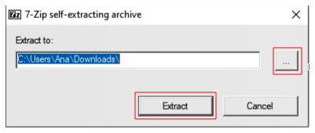

4) Depois desses passos, é necessário esperar a extração dos arquivos até a barra de progresso ficar cheia e verificar se foi criada uma pasta chamada UniServerZ.

    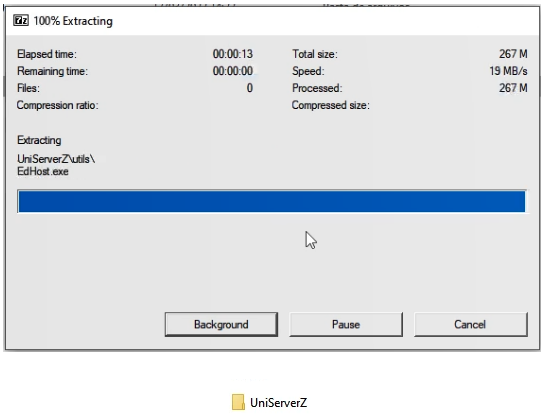

5) Ao clicar na pasta UniServerZ, selecionaremos o arquivo `UniController` para controlar o servidor. Será aberta uma janela para cadastrar uma senha de acesso ao servidor. Insira uma senha e memorize-a! Agora é só apertar no botão OK.

    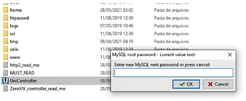

6) Após definir uma senha é só esperar até que o servidor confirme a inserção da senha. Depois dessa ação, será aberto o UniController. Para ativar o MySQL basta clicar no botão `Start MySQL`.

    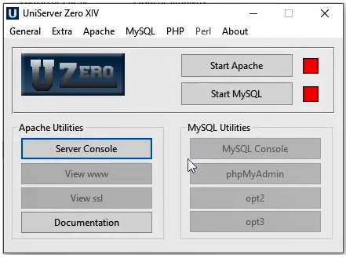

7) O MySQL estará ativo desde que a luz ao lado do botão “Stop MySQL” esteja verde. Não é necessário fechar essa janela, dá para minimizar e seguir a instalação dos outros componentes.

    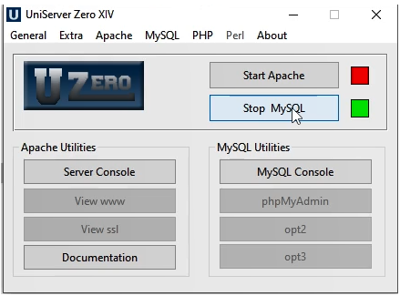

8) Se você quiser verificar se o MySQL está no ar, é necessário apenas verificar se na barra de tarefas do Windows contém um ícone com a letra “U” na cor branca dentro de um quadrado azul.

    

9) Para instalar o MySQL Worbenck, digitarmos `mysql workbenck download` no Browser. Nos resultados, escolha a opção dev.mysql.com/ ou clique em https://dev.mysql.com/downloads/workbench/ e clique em Download.

    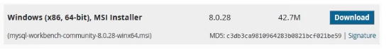

10) Entre ou crie um login na Oracle. Na sequência, espere até ele lhe redirecionar para página de Download e clique em `Download Now`.

    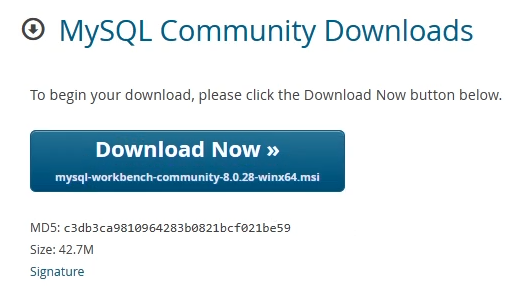

11) É importante citar que mesmo realizando esse passo a passo, caso o C++ não estiver instalado previamente, pode aparecer uma janela de erro conforme imagem abaixo.

    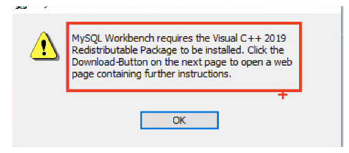

12) Caso essa janela apareça para você, digite no browser `microsoft 2019 c++ redistributable` e escolha a página da Microsoft.

13) Já na página, escolha a versão x64: vc_redist.x64.exe ou clique no link https://aka.ms/vs/16/release/vc_redist.x64.exe e aguarde o download. Na sequência, clique no arquivo baixado e, na janela de diálogo, clique no botão `Instalar` e aguarde a instalação terminar.

14) Caso não tenha dado erro, quer dizer que você já tem o C++ instalado e pode usar o MySQL Workbench diretamente. Ao abrir o executável do workbench, aperte em Next e logo em seguida escolha o diretório da pasta criada no passo 1 clicando em change e procurando o endereço correto.

    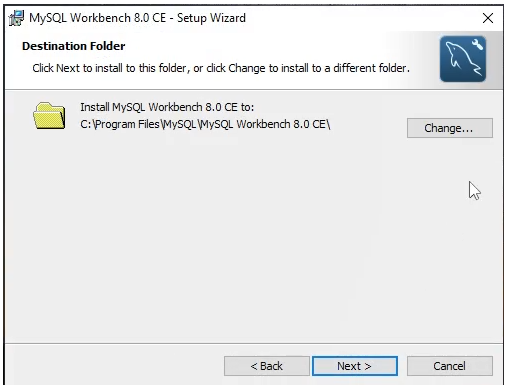

15) No próximo passo, selecione “complete” como tipo de setup para instalar todos os programas necessários. Clica em “Next” e espere a barra de progresso completar.

    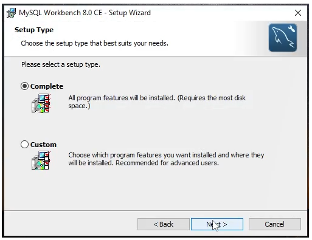

16) Download finalizado, aperte no botão “Finish”, para abrir o MySQL Workbench.

    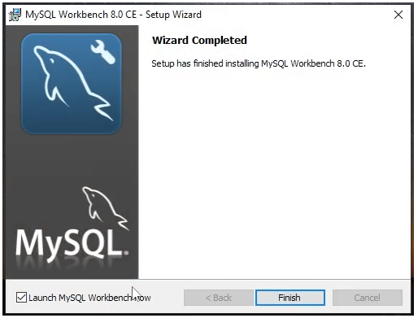

17) Com o MySQL Workbench aberto será criado uma conexão com o servidor clicando no botão de mais (+), localizado ao lado do MySQL Connections.

    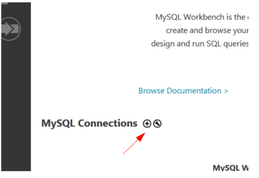

18) Logo após, será aberta uma janela para configurar a conexão. Preencha o nome da conexão em `Connection Name` e verifique se o hostname é `127.0.0.1` e a “port” é `3306`.

19) Insira a senha cadastrada no passo 5 e clique em `OK`.

    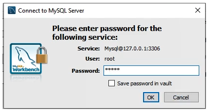

20) Clique em Ok na janela de “Setup New Connection” para criar a conexão. Aguarde até aparecer o botão de conexão na janela principal do MySQL Workbench.

    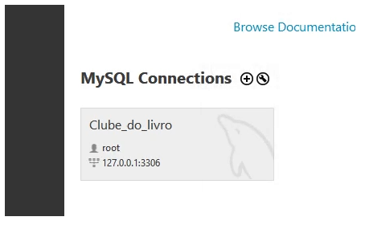

### **Indo além:**

Essa é uma das maneiras de instalação do MySql. O Uniform server é um conjunto de servidores que possui o MySQL e simplifica a instalação. Entretanto, no site do [MySQL](https://dev.mysql.com/downloads/installer/) é possível instalar de forma autônoma se preferir.

Para o sistema operacional linux, você pode conferir também o passo a passo de como instalar o MySQL Worbenck [nesse artigo](https://www.alura.com.br/artigos/conectando-workbench-mysql-linux) escrito pala instrutora pela Maria Gabriela.
#
## **Criando esquema(`CREATE SCHEMA`)**

Um esquema reune todas as tabelas

- No centro da tela tem a aba Query onde vamos declarar as consultas

**Comando**
```sql
CREATE SCHEMA CLUBE_DO_LIVRO;
```
#
- Toda vez que encerramos um comando usamos `;`
- Depois de encerrar selecionamos o msm comando e clicamos no `ícone de raio` ou `(CTRL + ENTER)`  para executar
- Vamos em `SCHEMAS` na lateral esquerda e clicamos no `ícone com as setas`  para atualizar os schemas
- Dando `duplo clique no esquema criado`, ficará em negrito sinalizando que todos os comandos executados apartir de agora fará referencia a esse esquema em questão, assim, dispensando o trabalho de ficar declarando ele no código.
#

## **Criando tabela(`CREATE TABLE`)**

**Comando**
```sql
CREATE TABLE LIVROS (
ID_LIVRO INT NOT NULL,
NOME_LIVRO VARCHAR(100) NOT NULL,
AUTORIA VARCHAR(100) NOT NULL,
EDITORA VARCHAR(100) NOT NULL,
CATEGORIA VARCHAR(100) NOT NULL,
PREÇO DECIMAL(5,2) NOT NULL,

PRIMARY KEY (ID_LIVRO)
);
```
#
- Dentro dos `()` é onde entra os campos da tabela
- Em decimal o 1° paramentro é a `quantidade de digitos` e o 2° é a `quantidade de casas decimais`
- `PRIMARY KEY ()` define a chave primaria da tabela
#
## **Principais tipos de dados em SQL**

### **1)`Numéricos exatos`**
    Inteiros de vários tamanhos que podem ser formatados

**Ex.:**

9.78 pode ser definida como decimal(3,2) 9 é número inteiro é do tipo int.

**Comando**
```sql
int, smallint, decimal(i,j), numeric(i,j), dec(i,j)
```
### **2) `Numéricos aproximados`**
    Números de ponto flutuante com precisão

**Ex.:**

7.90 é do tipo float

**Comando**
```sql
float ou real, double precision
```
#
### **3) `Cadeias de caracteres`**

#### **3.1) `Textos de tamanhos fixos`**
    
**Ex.:**

“modelagem” é char(9)

**Comando:**
```sql
char(n) ou character(n)
```
#### **3.2) `Texto de tamanho variável`**

**Comando:**
```sql
varchar(n) ou char varying(n) ou character varying(n)
```
#
### **4) `Valores lógicos`**
    Termos que representa verdadeiro ou falso

**Comando**
```sql
true, false ou unknown
```
#
### **5) `Datas`**
#### **5.1) `Datas, dias, mês, anos`**

**Ex.:**

Calendário lunar, calendário comercial

**Comando:**
```sql
Date DD-MM-YYYY ou YYYY-MM-DD-
```
#### **5.2) `Tempo`**

**Ex.:**

10:59:13 é tipo HH:MM:SS

**Comando:**
```sql
HH:MM:SS, timestamp
```
#

## **Alterando Tabela(`ALTER TABLE`)**

**Comando**
```sql
ALTER TABLE ESTOQUE ADD CONSTRAINT CE_ESTOQUE_LIVROS
FOREIGN KEY (ID_LIVRO)
REFERENCES LIVROS (ID_LIVRO)
ON DELETE NO ACTION
ON UPDATE NO ACTION;
```

- `ALTER TABLE` - Faz a alteração da tabela
- `ESTOQUE` - Nome da tabela que vai ser feita a alteração
- `ADD CONSTRAINT` - Adiciona uma restrição 
- `CE_ESTOQUE_LIVROS` - **CE** significa **C**have **E**strangeira
- `FOREIGN KEY ()` - Declara a chave estrageira
- `REFERENCES` - Temos que o ID_LIVRO da tabela estoque é a chave estrangeira que faz referência ao campo ID_LIVRO, só que da tabela “Livros”.
#
## **Alternado nome da coluna de uma tabela**
```sql
ALTER TABLE LIVROS RENAME COLUMN PRECO TO PREÇO;
```
#
### **Personalizando referências**
- `ON DELETE NO ACTION` e `ON UPDATE NO ACTION` - gera um erro toda vez que eu alterar um livro que estiver na tabela estoque, mas não estiver registrado na tabela “Livros”. 
#
## **Inserindo na tabela(`INSERT`)**

A inserção de dados é feita através do comando `INSERT INTO`.

Mas para inserir dados é necessario que a relação entre as tabelas esteja desativada. Ou seja, a chave estrangeira não deve está ligando uma tabela a outra

Usando o comando `SET FOREIGN_KEY_CHECKS = 0` - desativa as restrições de chave estrangeira, permitindo inserir informações em quaisquer tabelas.

`SET FOREIGN_KEY_CHECKS = 1` - Ativa novamente as chaves estrangeiras

Atribuido valores na tabela seguindo a ordem dos campos:

```sql
INSERT INTO LIVROS VALUES (
1,
"Percy Jackson e o Ladrão de Raios",
"Rick Riordan",
"Intrínseca",
"Aventura",
34.65);
```
#
## **Inserindo múltiplas linhas**
```sql
INSERT INTO VENDEDORES VALUES
(1, 'Paula Rabelo'),
(2, 'Juliana Macedo'),
(3, 'Roberto Barros'),
(4, 'Barbara Jales');
```
#
## **Inserindo fora de ordem**

Basta indicar os campos na ordem que os dados foram inseridos
```sql
INSERT INTO LIVROS 
(CATEGORIA, AUTORIA, NOME_LIVRO, EDITORA, ID_LIVRO, PREÇO)
VALUES
('Biografia', 'Malala Yousafzai', 'Eu sou Malala', 'Companhia das Letras', 11, 22.32);
```
#
## **Excluindo tabela(`DROP`)**
```sql
DROP TABLE VENDEDORES;
```
#
## **Consultando dados(`SELECT`)**
```sql
SELECT * FROM LIVROS;
```

Seleciona todas a linhas e colunas da tabela

```sql
SELECT NOME_DO_CAMPO FROM LIVROS;
```
#
**Apelidando o campo(`AS`)**
```sql
SELECT ID_LIVRO AS "Codigo do Livro" FROM LIVROS;
```
Como o apelido tem espaços colocamos `""`
#
## **Filtros no SQL(`WHERE`)**
```sql
SELECT * FROM LIVROS
WHERE NOME_DO_CAMPO = "BIOGRAFIA";
```
Filtra o campo e pega apenas os que contém "BIOGRAFIA" e traz junto todos os campos restantes.
#
Usando `WHERE` junto com `AND`
```sql
SELECT * FROM LIVROS
WHERE CATEGORIA = "romance" AND PREÇO < 48;
```
Seleciona todos os romances com preço menor que 48
#
Usando `WHERE` junto com `AND NOT e OR`
```sql
SELECT * FROM LIVROS
WHERE CATEGORIA = "POESIA" AND NOT (AUTORIA = "Luís Vaz de Camões" OR AUTORIA = "Gabriel Pedrosa");
```
Seleciona todos os livros que não são da autoria dos autores destacados
#
Usando `WHERE` junto com `LIKE` - extrai valores da tabela que possuem uma parte específica.

```sql
SELECT CIDADE, ESTADO
FROM MAPA
WHERE CIDADE LIKE '%LÂNDIA';
```
Pega todos os valores do campo `CIDADE` que terminem com `LÂNDIA`.

O operador `%` determina a localização

**Ex.:**

- Cidades que começam com A, basta usar `A%`. 

- Cidades que contém a sílaba ‘ma’, podemos usar o `%MA%` para aparecer todas as cidades que possuem ‘ma’ posicionada em qualquer lugar.
#
## **Seleção distinta(`SELECT DISTINCT`)**
```sql
SELECT DISTINCT ID_LIVRO FROM VENDAS
WHERE ID_VENDEDOR = 1
ORDER BY ID_LIVRO;
```

- `SELECT DISTINCT` - Elimina linhas duplicadas
- `WHERE ID_VENDEDOR = 1` - Filtra apenas o vendedor com ID 1
- `ORDER BY` - Ordena os IDs de forma crescente
#
## **Alterando as informações**

**Deletando(`DELETE`)**
```sql
DELETE FROM LIVROS WHERE ID_LIVRO = 8;
```

**Alterando(`UPDATE`)**

Colocando 10% de desconto
```sql
UPDATE LIVROS SET PREÇOS = 0.9*PREÇO;
```
- `SET` - Defina onde será feita a alteração
- `0.9*PREÇO` - Define que seja 90% dele mesmo
#
## **Filtro usando duas tabelas**
```sql
SELECT VENDAS.ID_VENDEDOR, 
       VENDEDORES.NOME_VENDEDOR, 
       SUM(VENDAS.QTD_VENDIDA) AS QTD_VENDIDA 
FROM VENDAS, VENDEDORES
WHERE VENDAS.ID_VENDEDOR = VENDEDORES.ID_VENDEDOR
GROUP BY VENDAS.ID_VENDEDOR;
```
- 1° linha: Seleciona `ID_VENDEDOR` da tabela vendas, `NOME_VENDEDOR` da tabela vendedores e soma(`SUM`) a `QTD_VENDIDA` da tabela vendas

- 2° linha: Indica as tabelas que estão sendo referenciadas
- 3° linha: Indica que o `ID_VENDEDOR` é igual para as duas tabelas tanto de vendas quanto de vendedores
- 4° linha: Indicamos que existe um agrupamento utilizando o `GROUP BY`, assim indicamos para o SQL que será feita uma soma a partir de um grupo especifico. Nesse caso estamos somando, mas agrupado pelo codigo do vendedor
#
## **`Inner Join`**

Faz a junção entre tabelas e mostra informações que existem em ambas as tabelas referenciadas.

É a interseção entre tabelas

**Ex.:**
```sql
SELECT VENDAS.ID_VENDEDOR, 
       VENDEDORES.NOME_VENDEDOR, 
       SUM(VENDAS.QTD_VENDIDA) AS QTD_VENDIDA 
FROM VENDAS INNER JOIN VENDEDORES
ON VENDAS.ID_VENDEDOR = VENDEDORES.ID_VENDEDOR
GROUP BY VENDAS.ID_VENDEDOR;
```

Pegamos o mesmo exemplo usado anteriormente e substituimos a `,` entre as tabelas e colocamos `INNER JOIN` e trocamos o `WHERE` por `ON`. Assim gerando o mesmo resultado do exemplo anterio, mas feito de uma forma diferente. 

#
## **funções de agregação - Métricas**

- `MAX`: a partir de um conjunto de valores é retornado o maior entre eles;
- `MIN`: analisa um grupo de valores e retorna o menor entre eles;
- `SUM`: calcula o somatório dos valores de um campo específico;
- `AVG`: realiza a média aritmética dos valores de uma determinada coluna; e
- `COUNT`: contabiliza a quantidade de linhas selecionadas.

**Ex.1:**

Para saber a maior venda
```sql
SELECT MAX(QTD_VENDIDA) FROM VENDAS;
```

**Ex.2:**

Para saber a maior venda por código de pessoa vendedora
```sql
SELECT MAX(QTD_VENDIDA) FROM VENDAS
GROUP BY(ID_VENDEDOR);
```

Saiba mais: https://www.alura.com.br/artigos/trabalhando-funcoes-de-agregacao
#
## **`LEFT JOIN`**
```sql
SELECT LIVROS.NOME_LIVRO,
       VENDAS.QTD_VENDIDA
FROM LIVROS LEFT JOIN VENDAS
ON LIVROS.ID_LIVRO = VENDAS.ID_LIVRO
WHERE VENDAS.QTD_VENDIDA IS NULL;
```
- 3° linha: Compara a tabelas Livros com a vendas levando em consideração o lado esquerdo
- 5° linha: Pega todas a quantidades sendo valor nulo
#
## **`RIGHT JOIN`**
```sql
SELECT VENDAS.ID_LIVRO,
	   LIVROS.NOME_LIVRO,
	   VENDAS.QTD_VENDIDA
FROM LIVROS RIGHT JOIN VENDAS
ON LIVROS.ID_LIVRO = VENDAS.ID_LIVRO
```
#
## **`Full Outer Join`**
**Incluindo a interseção**
```sql
SELECT <CAMPOS>
FROM TABELA_A
FULL OUTER JOIN TABELA_B
ON TABELA_A.CAMPO = TABELA_B.CAMPO
```
#
Saiba mais: https://www.alura.com.br/artigos/join-em-sql
#
## **Diminuindo a consulta**
**Consulta inicial**
```sql
SELECT LIVROS.NOME_LIVRO,
           VENDAS.QTD_VENDIDA
FROM LIVROS, VENDAS
WHERE VENDAS.ID_LIVRO = LIVROS.ID_LIVRO;
```
**Consulta reescrita**
```sql
SELECT A.NOME_LIVRO,
           B.QTD_VENDIDA
FROM LIVROS AS A, VENDAS AS B
WHERE B.ID_LIVRO = A.ID_LIVRO;
```
**Omitindo o `AS`**
```sql
SELECT A.NOME_LIVRO,
           B.QTD_VENDIDA
FROM LIVROS A, VENDAS B
WHERE B.ID_LIVRO = A.ID_LIVRO;
```