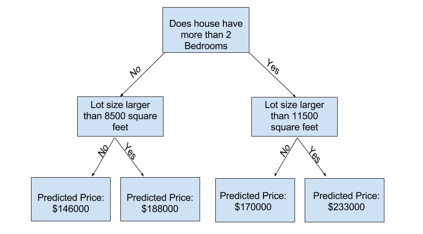
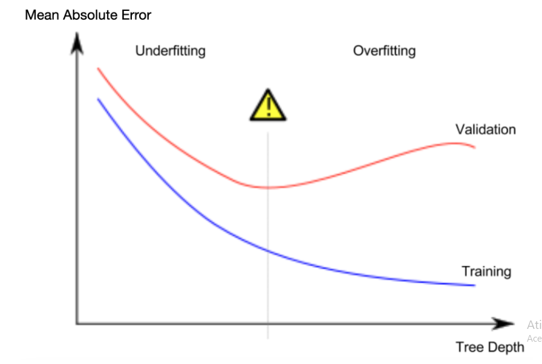

# Experimentando com Diferentes Modelos

Agora que você tem uma maneira confiável de medir a precisão do modelo, pode experimentar com modelos alternativos e ver qual oferece as melhores previsões. Mas que alternativas você tem para modelos?

Você pode ver na documentação do scikit-learn que o modelo de árvore de decisão tem muitas opções (mais do que você vai querer ou precisar por um longo tempo). As opções mais importantes determinam a profundidade da árvore. Lembre-se da primeira lição deste curso que a profundidade de uma árvore é uma medida de quantas divisões ela faz antes de chegar a uma previsão. Esta é uma árvore relativamente rasa.

Na prática, não é incomum que uma árvore tenha 10 divisões entre o nível superior (todas as casas) e uma folha. À medida que a árvore fica mais profunda, o conjunto de dados é dividido em folhas com menos casas. Se uma árvore tiver apenas 1 divisão, ela divide os dados em 2 grupos. Se cada grupo for dividido novamente, teremos 4 grupos de casas. Dividir cada um desses novamente criaria 8 grupos. Se continuarmos dobrando o número de grupos adicionando mais divisões em cada nível, teremos 210 grupos de casas quando chegarmos ao 10º nível. Isso resulta em 1024 folhas.

Quando dividimos as casas em muitas folhas, também temos menos casas em cada folha. Folhas com poucas casas farão previsões bastante próximas dos valores reais dessas casas, mas podem fazer previsões muito pouco confiáveis para novos dados (porque cada previsão é baseada em apenas algumas casas).

Isso é um fenômeno chamado de overfitting, onde um modelo se ajusta quase perfeitamente aos dados de treinamento, mas tem um desempenho ruim em dados de validação e outros novos dados. Por outro lado, se tornarmos nossa árvore muito superficial, ela não divide as casas em grupos muito distintos.

Em um extremo, se uma árvore dividir as casas em apenas 2 ou 4, cada grupo ainda terá uma ampla variedade de casas. As previsões resultantes podem estar muito distantes para a maioria das casas, mesmo nos dados de treinamento (e serão ruins na validação também pelas mesmas razões). Quando um modelo falha em capturar distinções e padrões importantes nos dados, ele tem um desempenho ruim mesmo nos dados de treinamento, o que é chamado de underfitting.

Uma vez que nos importamos com a precisão em novos dados, que estimamos a partir dos nossos dados de validação, queremos encontrar o ponto ideal entre o underfitting e o overfitting. Visualmente, queremos o ponto mais baixo da curva de validação (vermelha) na figura abaixo.

# Exemplo

Existem algumas alternativas para controlar a profundidade da árvore, e muitas permitem que algumas rotas pela árvore tenham uma profundidade maior do que outras rotas. Mas o argumento max_leaf_nodes fornece uma maneira muito sensata de controlar o overfitting versus underfitting. Quanto mais folhas permitimos que o modelo crie, mais nos movemos da área de underfitting no gráfico acima para a área de overfitting.

Podemos usar uma função utilitária para ajudar a comparar as pontuações MAE de diferentes valores para max_leaf_nodes:

from sklearn.metrics import mean_absolute_error
from sklearn.tree import DecisionTreeRegressor

def get_mae(max_leaf_nodes, train_X, val_X, train_y, val_y):
    model = DecisionTreeRegressor(max_leaf_nodes=max_leaf_nodes, random_state=0)
    model.fit(train_X, train_y)
    preds_val = model.predict(val_X)
    mae = mean_absolute_error(val_y, preds_val)
    return(mae)

Os dados são carregados em train_X, val_X, train_y e val_y usando o código que você já viu (e que você já escreveu).

Podemos usar um loop for para comparar a precisão dos modelos construídos com diferentes valores para max_leaf_nodes.

#compare MAE with differing values of max_leaf_nodes

for max_leaf_nodes in [5, 50, 500, 5000]:
    my_mae = get_mae(max_leaf_nodes, train_X, val_X, train_y, val_y)
    print("Max leaf nodes: %d  \t\t Mean Absolute Error:  %d" %(max_leaf_nodes, my_mae))

# Conclusão

Aqui está o resumo: Modelos podem sofrer com:

* Overfitting: capturando padrões irrelevantes que não vão se repetir no futuro, resultando em previsões menos precisas; ou
* Underfitting: falhando em capturar padrões relevantes, também resultando em previsões menos precisas.

Usamos dados de validação, que não são usados no treinamento do modelo, para medir a precisão de um modelo candidato. Isso nos permite testar muitos modelos candidatos e escolher o melhor.
