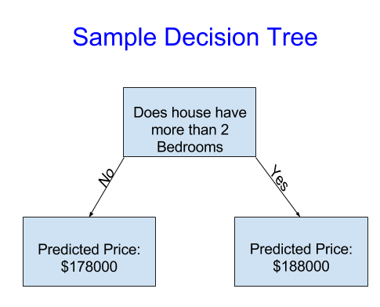
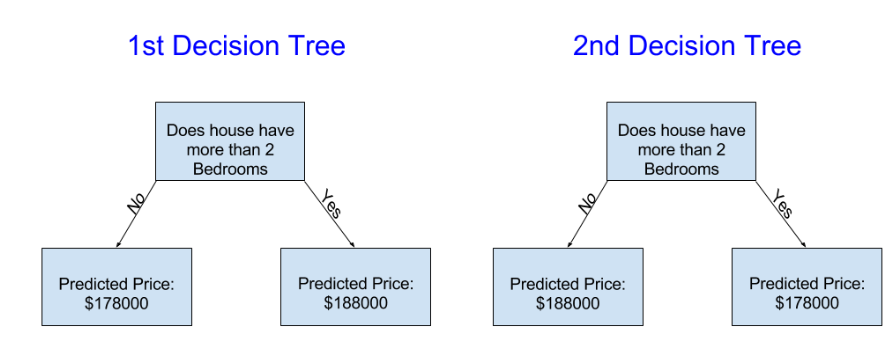
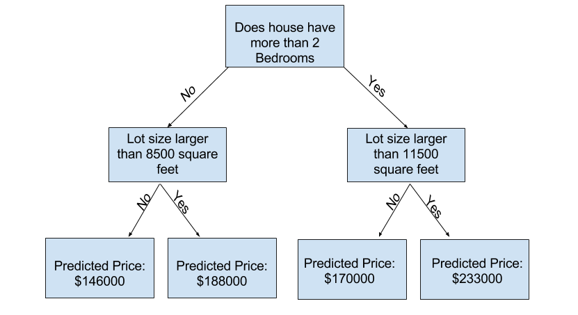

# Introdução

Neste curso, começaremos com uma visão geral de como funcionam os modelos de aprendizado de máquina e como eles são usados. Isso pode parecer básico se você já fez modelagem estatística ou aprendizado de máquina antes. Não se preocupe, avançaremos para a construção de modelos poderosos em breve.

Durante o curso, você construirá modelos seguindo o seguinte cenário:

Seu primo fez milhões de dólares especulando no mercado imobiliário. Ele ofereceu-se para se tornar parceiro de negócios com você por causa do seu interesse em ciência de dados. Ele fornecerá o dinheiro, e você fornecerá modelos que prevejam quanto várias casas valem.

Você pergunta ao seu primo como ele previu os valores imobiliários no passado, e ele diz que é apenas intuição. Mas mais perguntas revelam que ele identificou padrões de preço das casas que ele já viu no passado e usa esses padrões para fazer previsões para novas casas que ele está considerando.

O aprendizado de máquina funciona da mesma maneira. Começaremos com um modelo chamado Árvore de Decisão. Existem modelos mais sofisticados que fornecem previsões mais precisas. Mas as árvores de decisão são fáceis de entender e são a base para alguns dos melhores modelos em ciência de dados.

Para simplicidade, começaremos com a árvore de decisão mais simples possível.

A árvore de decisão divide as casas em apenas duas categorias. O preço previsto para qualquer casa em consideração é a média histórica de preços das casas na mesma categoria.

Usamos dados para decidir como dividir as casas em dois grupos e, em seguida, determinar o preço previsto em cada grupo. Esta etapa de capturar padrões a partir de dados é chamada de ajuste ou treinamento do modelo. Os dados usados para ajustar o modelo são chamados de dados de treinamento.

Os detalhes de como o modelo é ajustado (por exemplo, como dividir os dados) são complexos o suficiente para serem abordados mais tarde. Depois que o modelo é ajustado, você pode aplicá-lo a novos dados para prever preços de outras casas.

# Melhorando a Árvore de Decisão

Qual das seguintes duas árvores de decisão é mais provável de resultar do ajuste dos dados de treinamento imobiliário?

A árvore de decisão à esquerda (Árvore de Decisão 1) provavelmente faz mais sentido, porque captura a realidade de que casas com mais quartos tendem a ser vendidas a preços mais altos do que casas com menos quartos. A maior limitação desse modelo é que ele não captura a maioria dos fatores que afetam o preço das casas, como número de banheiros, tamanho do terreno, localização, etc.

Você pode capturar mais fatores usando uma árvore que tenha mais "divisões". Essas são chamadas de árvores "mais profundas". Uma árvore de decisão que também considere o tamanho total do terreno de cada casa pode parecer assim:

Você prevê o preço de qualquer casa seguindo a árvore de decisão, sempre escolhendo o caminho correspondente às características daquela casa. O preço previsto para a casa está na parte inferior da árvore. O ponto na parte inferior onde fazemos uma previsão é chamado de folha.

As divisões e valores nas folhas serão determinados pelos dados, então é hora de você conferir os dados com os quais estará trabalhando.
